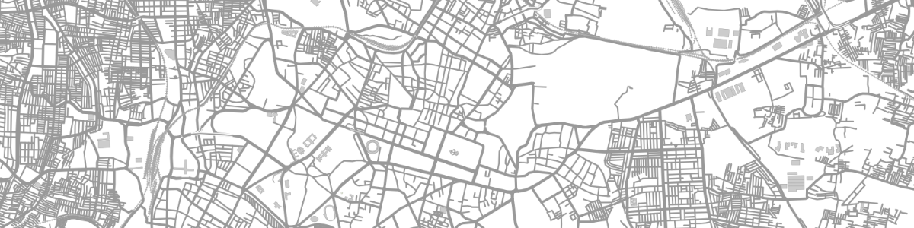

Getting Started
===============

Maps are beautiful. They can convey information in a way that words and graphs cannot.
As a GIS company, we have many occassions where maps are absolutely critical to 
show our outputs. Pyqtlet was partly built out of a frustration of having to use
Google Earth and KML files for all our mapping needs.

.. note::
    pyqtlet was designed for people familiar with both `PyQt5 <http://zetcode.com/gui/pyqt5/>`_ and `Leaflet <https://leafletjs.com/examples/quick-start/>`_.
    It is suggested you go through the respective guides if not already familiar.

    
Installation
------------

pyqtlet does not have any external dependencies apart from PyQt5. So if you already 
have pyqtlet installed, then you just need to copy the pyqtlet folder into your
project folder. You may also install pyqtlet  from pip. This will install PyQt5 if
it has not been installed already.

.. code:: sh

    pip3 install pyqtlet

Now you're just an import statement away.

.. code:: python

    from pyqtlet import L, MapWidget

Usage
-----

MapWidget should be used like any other QWidget. The first pyqtlet object to be
created needs to be the L.map, along with a reference to the map widget.
If you try creating any other pyqtlet object before the map, or the map without the
map widget, you will get an error.

.. code:: python

    # within a QWidget
    self.mapWidget = MapWidget()
    self.map = L.map(self.mapWidget)
    self.layout.addWidget(self.mapWidget)

Once this has been set up, :code:`self.map`, and pyqtlet as a whole have methods 
very similar to leaflet itself. So in case you want to set the view, set a basemap,
and add some markers, the code would look something like this...

.. code:: python

    self.map.setView([12.97, 77.59], 10)
    L.tileLayer('http://{s}.tile.osm.org/{z}/{x}/{y}.png').addTo(self.map)
    self.marker = L.marker([12.934056, 77.610029])
    self.marker.bindPopup('Maps are a treasure.')
    self.map.addLayer(self.marker)

Similarly, a lot of the other leaflet objects can be found in the :code:`L` namespace.
So polygons, circle markers and feature groups can also be added using code that is
essentially identical to its JS counterpart.

Accessing state of the map
--------------------------

Sometimes, it is necessary to access different state attributes of the map. pyqtlet 
allows this to be done. The variables cannot currently be directly returned by the
functions, so a callback approach is followed whenever we need to access state of
the map

.. code:: python
    
    def setZoomWarning(self, event):
        zoom = event['zoom']
        if zoom < 6:
            self.label.setText('Woah buddy. You\'re flying \
                pretty high. Hope you don\'t have vertigo..')
        else:
            self.label.setText('Yup, no worries. A fall from \
                here shoudn\'t hurt... too much.')

    def setWarnings(self):
        self.map.getZoom(self.setZoomWarning)

Similarly, we can access different state variables of Leaflet. There is also a custom
function called :code:`L.map.getState()` that allows you to get all of the map parameters
that leaflet allows you to access. This was written to prevent excessive callback depth
in case multiple map state variables are required.

Drawing
-------

Since a large benefit of having maps is allowing users to draw on them, pyqtlet includes
`Leaflet.draw` by default. Since editting is a fairly core functionality of drawing, and
setting it up in leaflet is a little cumbersome, pyqtlet sets it all up in case the user
doesn't want to.

.. code:: python

    # in __init__ or elsewhere
    self.drawControl = L.control.draw()
    self.map.addControl(self.drawControl)

In order to get what the user has drawn, we will need to access the featureGroup of the
draw control. So to print what the user has drawn as a geojson.

.. code:: python

    self.drawControl.featureGroup.toGeoJSON(lambda x: print(x))

Default initialisation of the draw control creates a `L.FeatureGroup` and adds it to the 
map, and sets it as the edit
layer for `L.Draw`, and automatically takes care of adding all the drawn items to it.
It also sets the default position as :code:`'topleft'`, disables drawing of rectangles
and circles.

All of these can be overriden. So editting can be disabled by setting the :code:`'edit'`
key in the options as `False`. Similarly you can use your own featureGroup as the edittable
featureGroup by passing it as a parameter. 

Additionally, if you want to handle what gets
added to the featureGroup, you can setting :code:`handleFeatureGroup` as :code:`False`
while initiating the draw control. Then using :code:`L.map.drawCreated` and :code:`L.featureGroup.createAndAddDrawnLayer`
you can manually handle all the drawn shapes that are added to the map.    

Events and Signals
------------------
Leaflet and PyQt handle signals and events in different ways. pyqtlet follows the 
PyQt system of :code:`pyqtSignal` and :code:`pyqtSlot` to pass around events. So
all the leaflet events have been appropriately mapped to a signal of the same name.

.. code:: python
    
    self.map.clicked.connect(lambda x: print(x))
    self.map.zoomend.connect(self.loadAssetByZoom)

Similarly any other can be accessed as a :code:`pyqtSignal`. The signals from Leaflet.draw
are all prefixed with `draw` and are camel cased accordingly. So :code:`'draw:created'` 
becomes :code:`drawCreated` and so on.

Custom JS code
--------------
In case there is some JS code that needs to be run, which hasn't already been implemented
in pyqtlet, or is causing some kind of bug, that can also be done. If js objects need to
be used, their variable names in the leaflet runtime can be accessed from the :code:`.jsName`
attribute.

.. code:: python
    self.map.runJavaScript('{map1}.addLayer({layer})'.format(
        map1=self.map.jsName, layer=self.basemap.jsName))

If a response is expected from js, then the same callback approach will need to be followed

.. code:: python
    self.map.getJsResponse('{map1}.getZoom()+1'.format(
        map1=self.map.jsName), callback=self.handleNextZoomLevel)

With all the implemented pyqtlet functionality, `runJavaScript` and `getJsResponse`, pretty
much all the basic use cases have been covered.

****************

This should be enough to get you started and build all the basic functionality that you
might expect and need from a map. Further documentation on the API can be found on the
:doc:`api-docs` page. In case you are interested in the technical details and implementation details, 
you can refer to the :doc:`technical` page. For going deeper into the different use cases
that pyqtlet allows, refer to the :doc:`tutorials` page.
